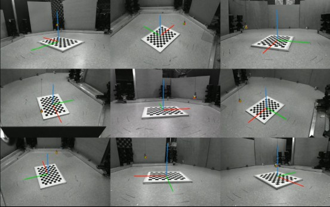
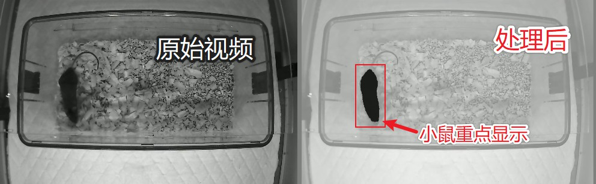
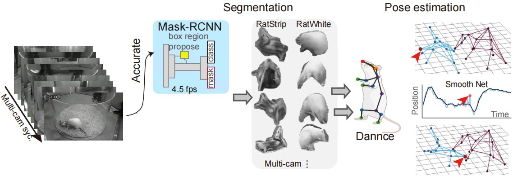
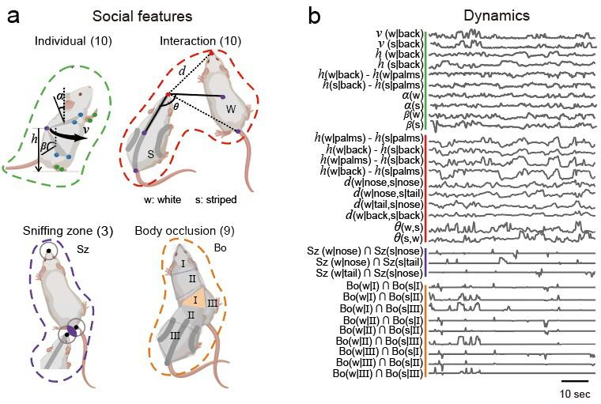

# Social-Seq 项目

欢迎来到 Social-Seq 项目！这是一个用于解析动物密切接触时的三维姿态、社交类别以及社交背后情绪状态的开源项目。通过构造实时行为分类系统，该项目有望用于治疗孤独症（ASD）社交障碍。

## 项目概述

Social-Seq 项目旨在通过计算机视觉和机器学习技术，分析动物（特别是大鼠）在社交互动中的行为模式。项目包含从硬件系统安装到行为分析的完整流程，能够实现高精度的三维姿态重建和自动化行为分类。

## 主要功能模块

### 1. 硬件系统安装
安装多相机系统，调试OBS，启用F2同步助手。

### 2. 小球矫正
使用小球标定多相机系统的空间坐标系，实现快速精准的多相机标定。

### 3. 小鼠图像分割增强
在复杂背景中，使用分割模型增强小鼠信噪比。

### 4. 社交三维关键点重构
实现两只大鼠的分割、关键点预测和平滑处理，获取稳定的3D姿态坐标。

### 5. 社交序列标签
获取大鼠社交一致性的36类行为标签，通过特征设计、聚类和一致性优化实现自动化行为分类。

## 技术流程

1. **数据采集**：使用OBS Studio录制9视角相机视频，确保多相机画面经过时间同步（误差在1帧及以内）。
2. **图像分割**：使用Mask-RCNN模型识别黑、白鼠身份并分割像素区域。
3. **姿态重构**：执行DANNCE关键点预测和神经网络平滑，获取3D姿态。
4. **行为分析**：设计32个社交特征，使用RNN自编码器模型Seq2Seq提取行为特征，通过K-means无监督聚类得到行为类别。
5. **标签优化**：通过双视角标签一致性匹配，筛选出36种可靠的聚类行为类别。

## 应用价值

- **孤独症研究**：为孤独症社交障碍的治疗提供技术支持
- **行为学分析**：自动化、高精度的行为分类和分析
- **神经科学研究**：深入理解动物社交行为的神经机制

## 贡献

最后更新时间 2025-8-14，作者 ChenXinfeng。

项目开源。