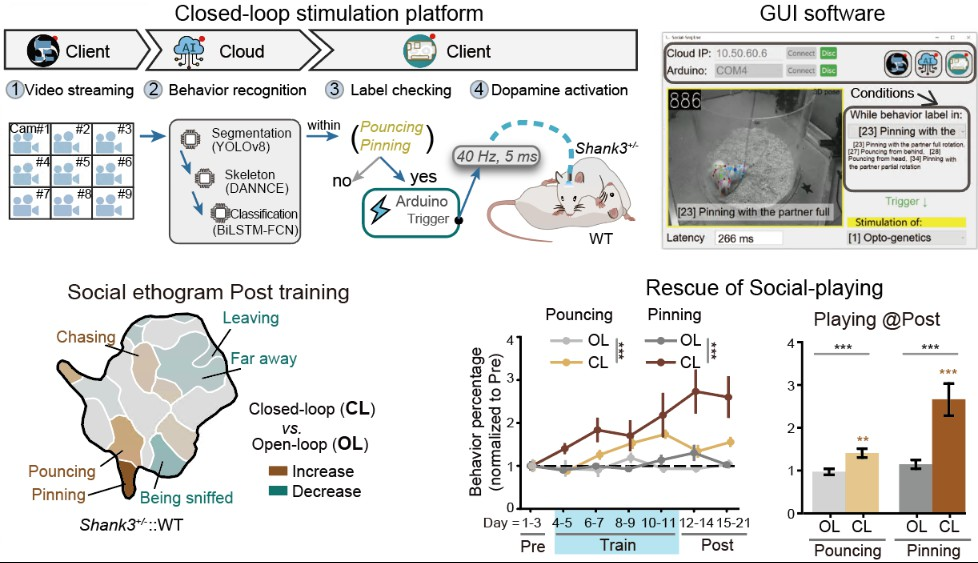

# Social-Seq Project 🐭

Language 🌐: [**中文**](README_cn.md) | English

Welcome to the Social-Seq project! This is a system for analyzing multi-animal classification, 3D pose reconstruction, social behavior recognition, and social sequence labeling during close animal interactions. Through constructing a real-time closed-loop optogenetic intervention system, this project has potential applications in treating social deficits in autism spectrum disorder (ASD). ✨

<a href="https://lilab-cibr.github.io/Social_Seq/"><b>Code download, Tutorial and Documentation</b> 🔗</a>

  

## Project Overview 📖

The Social-Seq project aims to analyze animal (particularly rat) behavior patterns during social interactions using computer vision and machine learning technologies. The project includes a complete workflow from hardware system installation to behavior analysis, achieving high-precision 3D pose reconstruction and automated behavior classification.

## Main Functional Modules 🧩

### 1. Equipment Assembly and Data Acquisition 📷
Acquiring high-quality, highly synchronized multi-view videos to ensure data quality for behavior analysis.

### 2. Social 3D Pose Reconstruction ✨
Implementing segmentation, keypoint prediction and smoothing processing for two rats to obtain stable 3D pose coordinates.

### 3. Social Behavior Label Recognition 🏷️
Obtaining 36 categories of social behavior labels through feature design, clustering and consistency optimization to achieve automated behavior classification.

### 4. Social Difference Analysis 📈
Analyzing behavior differences between different rat models based on behavior label distribution.

### 5. Closed-loop Behavior Control ⚡️
Implementing behavior control using optogenetics technology through real-time behavior analysis.

  

## Application Value 💎

- **Autism Research** 👶: Providing technical support for treating social deficits in autism spectrum disorder (ASD)
- **Behavior Analysis** 📊: Automated, high-precision behavior classification and analysis
- **Neuroscience Research** 🧠: Deepening understanding of neural mechanisms underlying animal social behavior

## Code Release 📅
Last updated 2025-9-14, by ChenXinfeng.

## Citations 📚
Xinfeng Chen; Xianming Tao; Zhenchao Zhong; Yuanqing Zhang; Yixuan Li; Ye Ouyang; Zhaoyi Ding; Min An; Miao Wang; Ying Li* (2025). Decoding the Valence of Developmental Social Behavior: Dopamine Governs Social Motivation Deficits in Autism. In preparation.

Xinfeng Chen 陈昕枫(2025). Deep Learning-Based Framework for Analyzing Free Social Behavior in Model Animals. PhD Thesis, Peking University.

## Corresponding Author 📬
Ying Li 李莹, Chinese Institute for Brain Research, Beijing, China