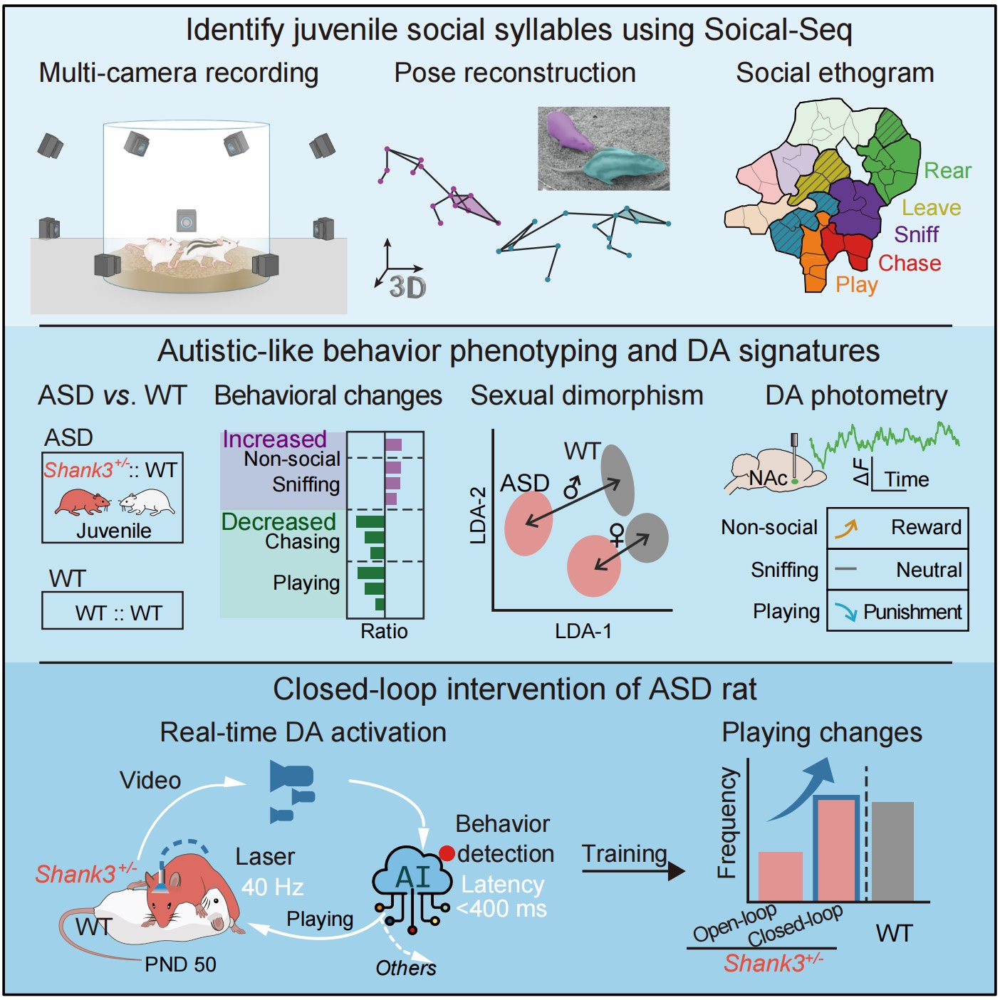
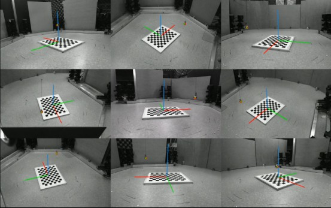

# Social-Seq 项目 🐭

语言🌐：中文🇨🇳 | [**English**](README.md)

欢迎来到 Social-Seq 项目！这是一个用于解析动物密切接触时的多动物分类、三维姿态重构、社交类别识别、社交序列标签。通过构造实时闭环光遗传干预系统，该项目有望用于治疗孤独症（ASD）社交障碍。✨

- 代码地址 📦：https://github.com/LiLab-CIBR/Social_Seq

- 项目文档 📚：https://lilab-cibr.github.io/Social_Seq/

  

## 项目概述 📖

Social-Seq 项目旨在通过计算机视觉和机器学习技术，分析动物（特别是大鼠）在社交互动中的行为模式。项目包含从硬件系统安装到行为分析的完整流程，能够实现高精度的三维姿态重建和自动化行为分类。🤖

## 技术流程 📖

1. **数据采集** 📹：使用OBS Studio录制9视角相机视频，确保多相机画面经过时间同步（误差在 1帧 = 33ms 及以内）。
2. **姿态重构** ✨：使用Mask-RCNN模型识别花、白鼠身份并分割像素区域。执行DANNCE关键点预测和神经网络平滑，获取3D姿态。
3. **无监督行为聚类** 📊：设计32个社交特征，使用RNN自编码器模型Seq2Seq提取行为特征，通过K-means无监督聚类得到行为类别。再进行标签优化，通过双视角标签一致性匹配，筛选出36种可靠的聚类行为类别。
4. **行为差异化定量** 📊：通过行为标签，定义大鼠的社交分布，使用PCA降维可视化，分析不同大鼠造模组别的行为分布差异。
5. **闭环行为控制** ⚡️：使用光遗传技术实现行为控制，通过实时行为分析，实现精准行为控制。

## 主要功能模块 🧩

### 1. 设备组装和数据采集 📷
采集高质量、高同步性的多视角视频，确保行为分析的数据质量。

- ❓ 问题：多相机的安装和配置比较复杂，往往需要特殊的硬件和软件支持，商业的造价较高，维护起来也比较麻烦。
- 💡 解决方案：使用普通的USB网络摄像头组成阵列，使用开源软件OBS Studio进行多视角视频录制。
- 🎉 结果：9个相机阵列，相机间时间同步性在33ms以内。每个1280x800分辨率，120fps。OBS Studio 录制多视角视频，HEVC 高效编码， 3.4GB/15min。成本低（￥10000：实验电脑，￥2000：9相机），使用和维护方便。

硬件系统由 9 个高速网络摄像头组成，这些摄像头以 120 fps 和 1280×800 分辨率捕捉灰度图像，并环形布置在直径 55 厘米的透明亚克力圆桶的上下两排。成本较低（300RMB/相机）的相机可满足需求。四周使用红光LED灯做照明（鼠对红光不敏感，不影响行为）。

软件系统采用开源软件 OBS Studio 录制多视角图像，总分辨率为 3840×2400，保持了每个相机的原始分辨率。为减少数据量，视频帧率被下采样至 30 fps。一次 15 分钟的行为实验记录产生一个 3.4 GB 的视频文件（HEVC编码）。相机之间的时间同步性 <33 ms。⏱️

### 2. 相机系统矫正 📐
矫正相机系统，得到相机间的相对位置和姿态，便于后续大鼠3D姿态重建。
- ❓ 问题：传统的棋盘标定法在环绕多相机系统中存在可视角局限。具体而言，在 9 个视角中，通常仅有 4–5 个视角能够同时获取棋盘的网格图像，导致相机坐标系的标定不充分。
- 💡 解决方案：小球在任意视角都可见的优点，将其视为标定用的标定点。操作时控制悬吊金属小球在实验空间内进行三维遍历运动，采集两分钟视频数据。将采集的视频通过目标检测网络处理得到小球中心点坐标，采用光束平差约束算法（BA）协同优化多相机外参。
- 🎉 效果：通过小球矫正，相机系统矫正误差约4.6像素，满足后续3D姿态重建需求。

详细步骤请参考[多相机标定](docs/小球矫正/application.md)。🔗

### 3. 社交三维姿态重构 ✨
实现两只大鼠的分割、关键点预测和平滑处理，获取稳定的3D姿态坐标。

- ❓ 问题：大鼠在密切遮挡情况下，身份难以区分，关键点预测存在误差。
- 💡 解决方案：使用染色标记花纹鼠，再用Mask R-CNN进行前景分割，得到两只大鼠的分割掩码。再使用DANNCE进行关键点预测，SmoothNet 神经网络平滑关键点轨迹。
- 🎉 效果：分割精度mAP 84%, 姿态关键点误差 4.7mm。在社交遮挡时（Pounce/Pin)，身份追踪稳定，关键点鲁棒。增加相机数量和使用分割图像预处理，显著提高了遮挡条件的关键点预测精度。

### 4. 社交行为标签识别 🏷️
获取大鼠社交一致性的36类行为标签，通过特征设计、聚类和一致性优化实现自动化行为分类。

- ❓ 问题：行为分类需要大量人工标注，耗时耗力。
- 💡 解决方案：基于行为特征设计，使用RNN自编码器模型Seq2Seq提取行为特征，再通过聚类和一致性优化实现自动化行为分类。
- 🎉 效果：提取行为特征，实现自动化行为分类。识别了Chasing， Sniffing， Leaving， Pouncing， Pinning， Rearing 等社交和非社交行为，类别全面且高分辨，可以替代人工标注。

### 5. 社交差异分析 📈
基于行为标签的分布，分析不同造模大鼠的行为差异。
- ❓ 问题：不同造模大鼠行为差异显著，需要定量分析。尤其是社交行为，存在模糊性，人工标注难以准确区分。
- 💡 解决方案：基于行为标签的分布，分析不同造模大鼠的行为差异。使用行为组成的PCA空间，对每只大鼠进行低维表征，分析组别区分度。
- 🎉 效果：发现孤独症（ASD）造模大鼠（Shank3+/-）存在玩耍社交减少、追逐减少、嗅闻增多的行为差异，在行为空间与WT具有可区分性。并量化综合行为表现受到性别和年龄的影响程度，发型ASD在青少年和雄性最为突出，成年和雌性不明显。

### 6. 闭环行为控制 ⚡️
使用光遗传技术实现行为控制，通过实时行为分析，实现精准行为控制。
- ❓ 问题：实时识别行为的计算量大，完整模型无法在实验间环境运行。边缘设备运行小模型的精度太低。生物应用方面，社交行为有不同效价，非特异性多巴胺刺激对孤独症行为改善受限。
- 💡 解决方案：使用云计算实现行为识别，进而实现行为控制。实验视频通过云平台上传，在云端进行行为识别，识别结果通过云平台返回。模型和代码经过轻量化改造，以及并行编程优化（将多个模型分摊到多个GPU中流水线并行），降低计算延迟。建立了孤独症行为-光遗传强化学习范式，在识别到玩耍行为时，即可给与多巴胺（dopamine，DA）释放光刺激，进而实现行为强化。
- 🎉 效果：行为识别延迟为266ms，识别准确率为80%。经过特异性光遗传强化学习，孤独症大鼠的玩耍行为得到了突出改善，社交能力增强，非社交行为减少。

  

## 应用价值 💎

- **孤独症研究** 👶：为孤独症社交障碍的治疗提供技术支持
- **行为学分析** 📊：自动化、高精度的行为分类和分析
- **神经科学研究** 🧠：深入理解动物社交行为的神经机制

## 代码发布 📅
最后更新时间 2025-8-14，作者 ChenXinfeng。👨‍💻

## 引用 📚
Xinfeng Chen; Xianming Tao; Zhenchao Zhong; Yuanqing Zhang; Yixuan Li; Ye Ouyang; Zhaoyi Ding; Min An; Miao Wang; Ying Li* (2025). Decoding the Valence of Developmental Social Behavior: Dopamine Governs Social Motivation Deficits in Autism. In preparation.

陈昕枫. (2025). 基于深度学习的动物自由社交行为分析研究. 博士论文，北京大学.

## 通讯作者 📬
- 李莹：liying