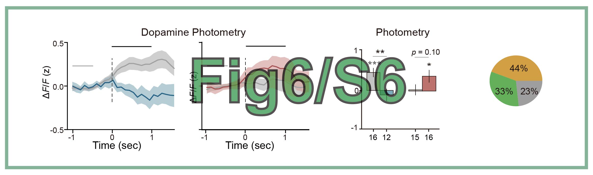

# Paper Code Reproduction
"(2025) Decoding the Valence of Developmental Social Behavior: Dopamine Governs Social Motivation Deficits in Autism. In preparation"

**Author**: Chen Xinfeng, 2025-08-09

**Modified**: Tao Xianming, 2025-08-15

## Code Download
The code has been uploaded to Github at: xxx. Please download the code from this link.

## Figures Gallery
Run the code in this repository to reproduce the figures in the paper.

