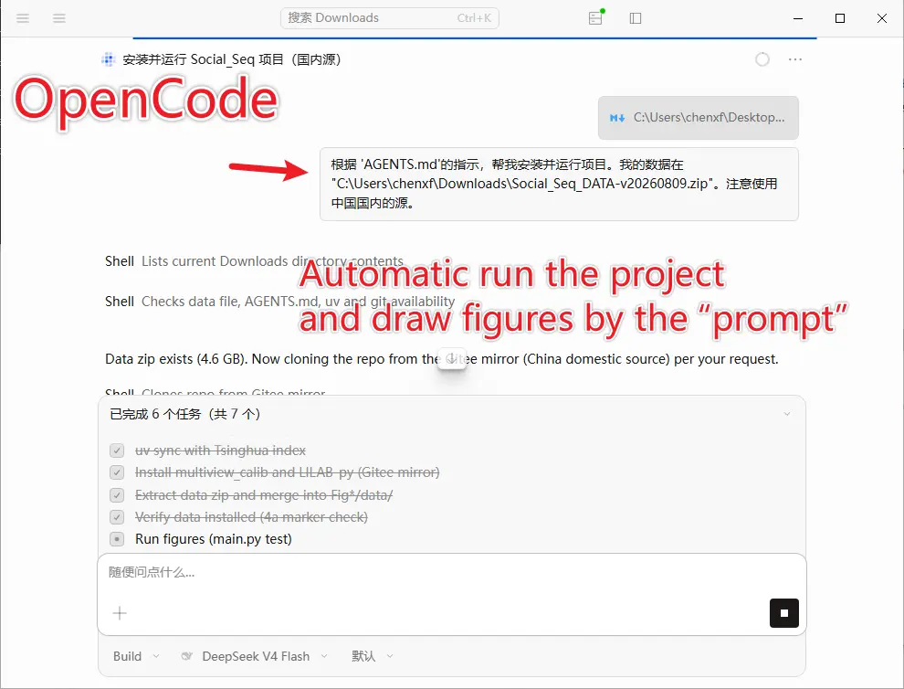

# Paper Figure Reproduction
"Chen X.F., Tao X.M., Zhong Z.C., Zhu F.Y., Zhang Y.Q., Wang Y.Z., Wang M., Sun L., Li Y.X., Ouyang Y., Ding Z.Y., An M., Zhao Y.Y., Zhou J.F., Zhang R., Xiong W., Ji N., Li Y., 2026. Sub-second dopaminergic reinforcement orchestrates juvenile social play and is disrupted in Shank3 deficiency. In preparation"

**Author**: Chen Xinfeng (2025-08-09). **Revised**: Tao Xianming (2025-08-15), Chen Xinfeng (2026-08-07).

## Figures Gallery
Run the code in this repository to reproduce all the figures in the paper. The images below show example outputs. Windows, Linux, and macOS are supported.


## 1. Code and Data Download

The data are openly available for download (file: `Social_Seq_DATA.rar`, ~4.1 GB) via [Mendeley Data🔗](https://data.mendeley.com/datasets/8w3b9xybzg) or [Baidu Cloud🔗](https://pan.baidu.com/s/1vg79XEUFDD-SLJz3Es0pdg?pwd=5maf). After downloading, extract the archive and rename the folder to `Figshare`.

The source code is openly available at [https://github.com/LiLab-CIBR/Social_Seq-Paper-Figure-Replication](https://github.com/LiLab-CIBR/Social_Seq-Paper-Figure-Replication).

The directory structures of the data and code are one-to-one matched. Please manually copy the contents of `Fig*/data/*` from the data folder into the corresponding code folder.

## 2. Installation (Recommended: Use an AI Agent)

You can use AI coding assistants such as OpenCode, Codex, or Claude. Just provide the following prompt, and they will automatically install the environment and generate all the figures.



> Follow the instructions at https://lilab-cibr.github.io/Social_Seq/assets/figure_reproduce/AGENTS.md to install and run the project, and generate all the figures. My data is located at `C:\PATH\XXXXX\Social_Seq_DATA-v20260809.zip`. Please use a domestic mirror source; otherwise, the installation will be very slow.

## 3. Manual Installation

For the detailed manual installation steps, please refer to "https://github.com/LiLab-CIBR/Social_Seq-Paper-Figure-Replication". The general process is as follows.

First, **install the dependency environment** using `uv`.

```bash
git clone https://github.com/LiLab-CIBR/Social_Seq-Paper-Figure-Replication .  # Download the code to the current folder

python3 -m pip install uv          # uv is a lightweight Python package manager, similar to conda

uv sync --index-url https://pypi.tuna.tsinghua.edu.cn/simple  # Users in mainland China may use the Tsinghua mirror; otherwise, the installation will be very slow
uv run python --version  # Verify the Python version (should be 3.12)
```

> **Note**: Do not use `uv` and `conda` simultaneously, as this will cause package installation conflicts. Please run `conda deactivate` first before running the commands below.

**Install Custom Packages**
```bash
uv pip install git+https://github.com/chenxinfeng4/multiview_calib.git
uv pip install git+https://github.com/chenxinfeng4/LILAB-py.git ../LILAB-py
```

### Generate a Single Figure: Fig1D.pdf
You can also run the scripts `Fig*/Fig*.py` one by one to generate a single figure.
```bash
uv run python Fig1_S1/Fig1D.py   # The result is saved to Fig1_S1/result/Fig1D.pdf
```
> **Note**: If any error occurs, please make sure all the data files have been downloaded correctly.

### Generate All Figures with One Command
```bash
uv run python main.py test
```
Figures such as Fig1*.pdf, FigS1*.pdf, Fig2*.pdf, ... will be generated and saved to the corresponding folders: `Fig*/result/*.pdf`, e.g., `Fig1_S1/result/Fig1G.pdf`.

### Clean All Results and Reset

```bash
uv run python main.py clean
```

Or manually delete all the result files:
```bash
rm Fig*/result/*pdf Fig*/result/*pkl Fig*/result/*png
```
