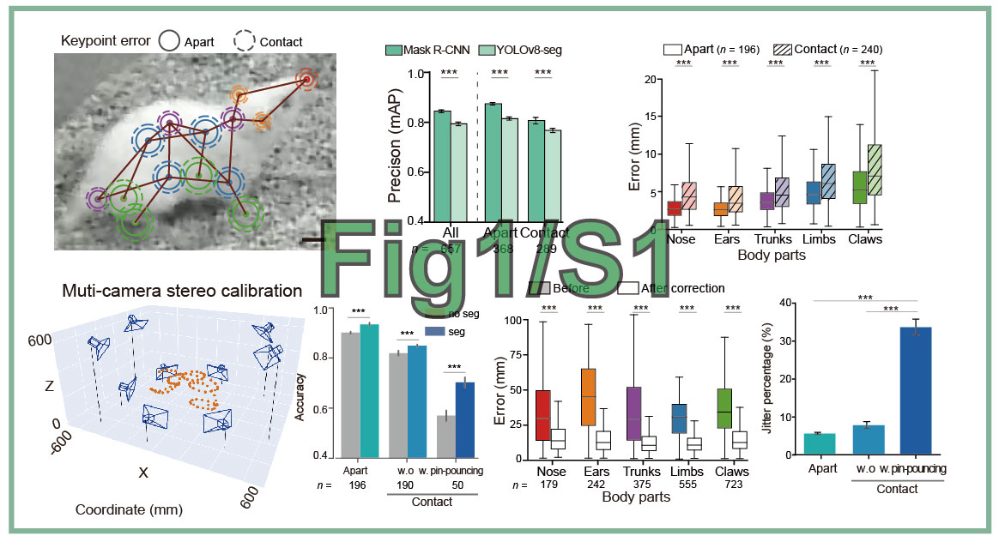
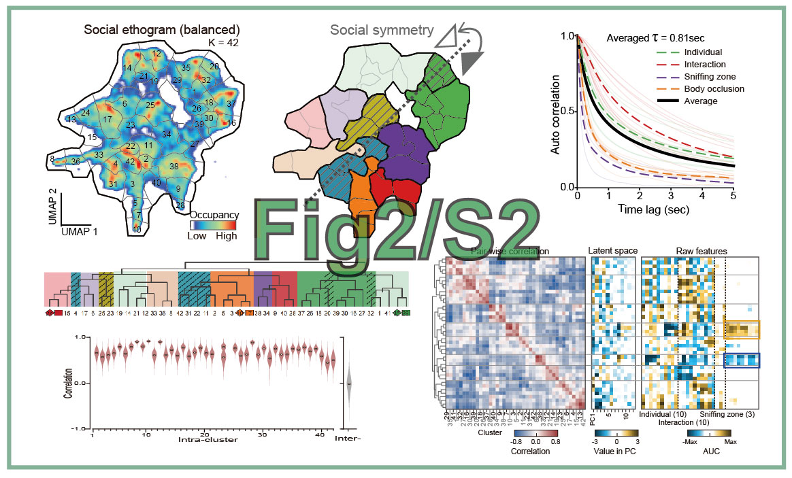
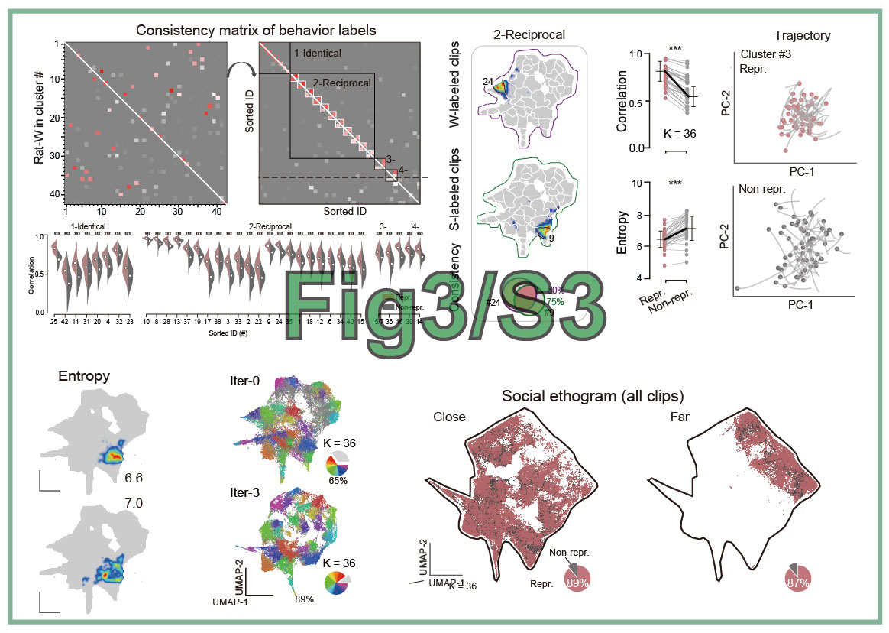
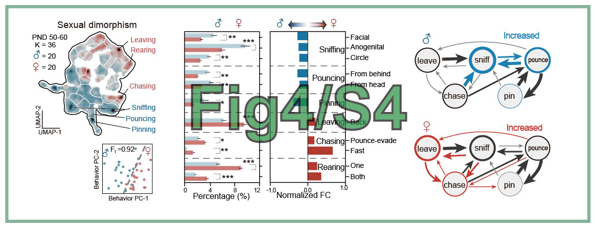
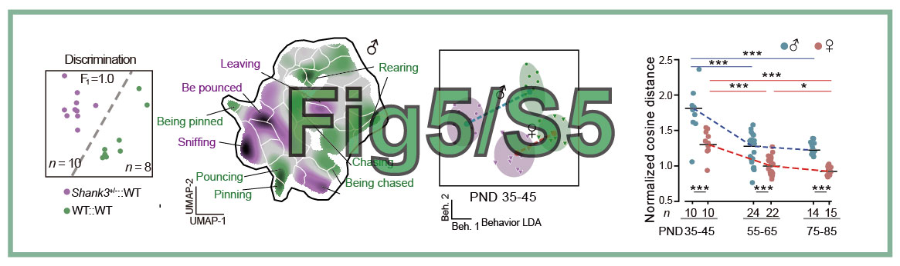
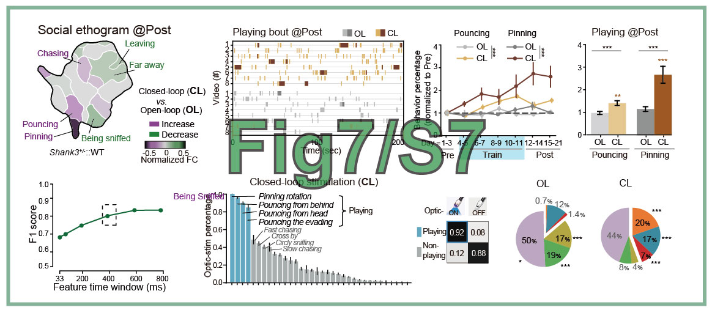

# 论文代码复现
"(2025) Decoding the Valence of Developmental Social Behavior: Dopamine Governs Social Motivation Deficits in Autism. In preparation"

**作者**: 陈昕枫, 2025-08-09
**修改**: 陶现明，2025-08-15

## 代码下载
代码已上传至 Github，链接为：xxx。请到此链接下载代码。

## Figures 图库
运行此仓库中的代码以复现论文中的图表。

