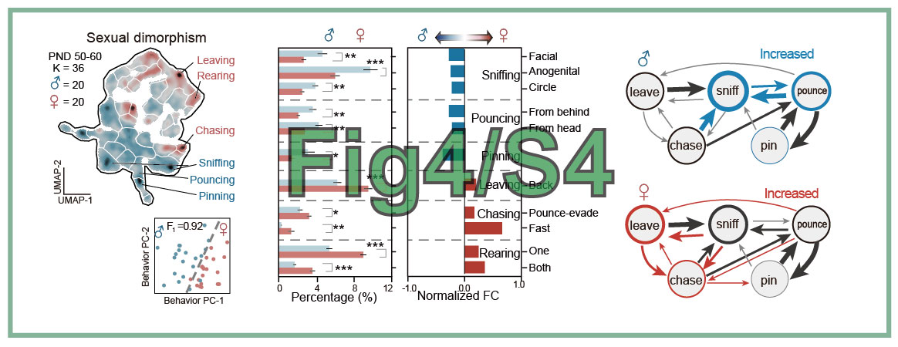
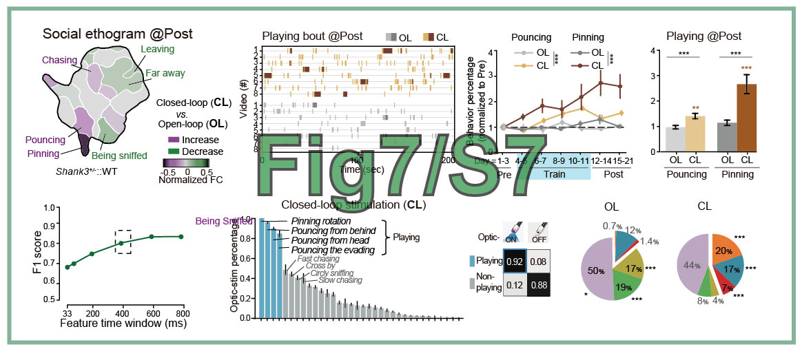

# 论文代码复现
"(2025) Decoding the Valence of Developmental Social Behavior: Dopamine Governs Social Motivation Deficits in Autism. In preparation"

**作者**: 陈昕枫, 2025-08-09. **修改**: 陶现明，2025-08-15.

## Figures 图库
运行此仓库中的代码以复现论文中的图表。








## 代码和数据下载

数据和代码已开源，链接为 [Figshare_DATA_20250818.zip🔗](https://pan.baidu.com/s/1YNHOnwKm2-YS8ZePG0TTOA?pwd=j6ab) (**~1.0 GB**)。
下载后解压到文件夹，命名为`Figshare`。

## 安装
支持 Windows、Linux 和 MacOS 系统。

首先，通过 `uv` 工具**安装依赖环境**。

!!! warning "警告”
    不要同时使用 `uv` 和 `conda`。这会导致包安装冲突。在运行以下代码之前，请先运行 `conda deactivate`。

```bash
# 在运行以下代码之前，请下载 FIGSHARE 代码和数据。
unzip Figshare_DATA_2025*.zip -d Figshare
cd Figshare

python3 -m pip install uv          # UV 是一个轻量级的 Python 包管理器，类似于 conda。

uv sync --index-url https://pypi.tuna.tsinghua.edu.cn/simple  # 中国用户可选清华镜像源，否则安装速度很慢。
uv run python --version  # 验证 Python 版本（应为 3.12）
```

**安装自定义包**
```bash
uv pip install git+https://github.com/chenxinfeng4/multiview_calib.git

git clone https://github.com/chenxinfeng4/LILAB-py.git ../LILAB-py
uv pip install -e ../LILAB-py

uv run python -m lilab.multiview_scripts_dev.p1_checkboard_global -h   # 验证安装
```


## 生成单个图表：Fig1C.pdf
您可以逐个运行 `Fig*/Fig*.py` 中的代码来生成图表。
```bash
uv run python Fig1_S1/Fig1C.py   # 结果保存到 Fig1_S1/result/Fig1C.pdf
```

> **注意**: 如果出现任何错误，请确保所有数据文件都已正确下载。

## 通过一个命令生成所有图表
```bash
uv run python main.py test
```

生成 Fig1*.pdf, FigS1*.pdf, Fig2*.pdf, ... 结果保存到相应的文件夹中。`Fig*/result/*.pdf`，例如 `Fig1_S1/result/Fig1E.pdf`。


## 清理所有结果，复原

```bash
#1. 删除所有结果数据
uv run python main.py clean

#2. 或者手动删除所有结果数据
rm Fig*/result/*pdf Fig*/result/*pkl Fig*/result/*png
```