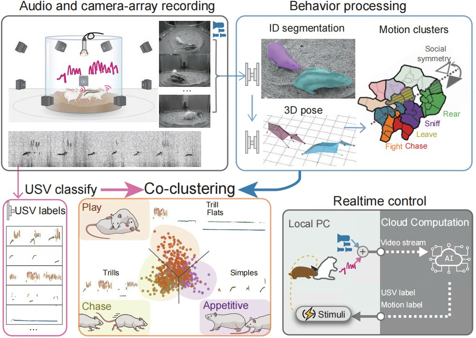

# Welcome to the Social-Seq Project

These are some explanatory documents for the Social-Seq project. Social-seq is used to analyze the 3D poses, social categories, and emotional states behind social interactions of animals in close contact. By constructing a real-time behavior classification system, it is potentially useful for treating autism (ASD) social disorders.

- Document here 📚：[https://lilab-cibr.github.io/Social_Seq/en/](https://lilab-cibr.github.io/Social_Seq/en/)

  

 

## Contents
* [**Figure Reproduction**](./figure_reproduction): Download code to reproduce the figures in the paper.
* [**Pipeline Playground**](./安装示例流程代码/pipeline_playground_installation/): Quickly install and run the core project code through Docker images.
* [**Equipment Assembly & List**](./设备组装和清单/shopping_list): Assemble multi-camera systems, obtain equipment list and server configuration.
* [**Ball Calibration**](./小球矫正/application): Calibrate the spatial coordinate system of the multi-camera system.
* [**Social 3D Pose (SOCIAL)**](./社交三维姿态重构/application): Use Mask R-CNN, DANNCE, SmoothNet to segment rat contours and obtain social 3D poses.
* [**Sequence Labeling (SEQ)**](./社交序列标签/application): Obtain 36 categories of consistent social behavior labels for rats.
* [**Closed-loop Control (LIVE)**](./闭环行为控制/application): Real-time identified social labels trigger optogenetic conditional stimulation to reinforce ASD rat social behavior.
 
## Code Release 📅
Last updated on 2025-12-8 by ChenXinfeng.

## References 📚
Xinfeng Chen*; Xianming Tao*; Zhenchao Zhong*; Yuanqing Zhang; Yixuan Li; Ye Ouyang; Zhaoyi Ding; Min An; Miao Wang; Ying Li# (2025). Decoding the Valence of Developmental Social Behavior: Dopamine Governs Social Motivation Deficits in Autism. *Under review*. <a href="../assets/chen_2025_socialseq_bioRXiv.pdf" target="_blank">[PDF download]</a>

Xinfeng Chen 陈昕枫 (2025). Deep Learning-Based Framework for Analyzing Free Social Behavior in Model Animals. PhD Thesis, Peking University.

## License
This project is licensed under the MIT License. You are free to use, modify, and distribute the code as long as you include the original copyright notice and this permission notice in all copies or substantial portions of the Software.

## Corresponding Author 📬
- Li Ying: liying