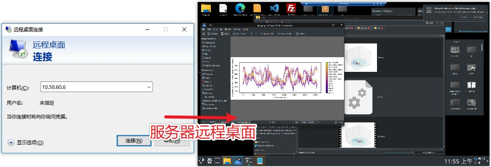

# 连接到服务器
## 服务器的详细参数
实验室有一套服务器和一台测试机。服务器用来专门做数据分析，不要私自安装软件包，以免破化它的环境。
想要学习linux的基本命令，可以在测试机上做。

|          | 服务器（高性能，浪潮）       | 测试机（临时使用）             |
| -------- | -------------------------------- | ------------------------------ |
| 用途     | 跑模型，跑流程，分析数据         | 测试代码，网页服务             |
| 地点     | 信息化中心B区负二楼机房         | 实验室             |
| 地址     | ssh chenxinfeng@`10.50.60.6`     | -   |
| 系统     | Ubuntu 18.04                     | -      |
| 基础命令 | sudo apt install PACKAGE         | -|
| 内存     | 256 GB                           | -|
| 硬盘     | 1 TB固态 + 8 TB机械               | -    |
| CPU      | Intel Silver 4314，32核心 64线程 | - |
| GPU      | 4块 NVIDIA RTX3090 （24 GB显存） | -  |
| docker   | 支持                             | -|

## 登录到服务器（/测试机）
服务器支持 `远程桌面`, `ssh` 和 `vscode` 的登录方式。推荐使用 `vscode`。


### 1. 使用 `vscode` [最推荐]
去官网[下载 VSCODE](https://code.visualstudio.com/Download)，安装。之后再安装 `Remote - SSH` 插件。通过插件进入远程的服务器。在服务器中进入项目目录，再安装 `Python` 和 `Jupyter` 插件。

!!! Warning "警告"
    首次用 VSCODE 登录远程SSH，会在服务器中自动下载软件并配置环境，请耐心等待。VSCODE 经常更新，会导致 `Python` 和 `Jupyter`
    环境时效。出现这种情况，请更新 VSCODE 并重启软件。可以在设置里面取消 VSCODE 自动更新。

!!! Error "错误"
    早期的 WINDOWS 电脑的系统有问题，VSCODE中使用 SSH 连接时一直转圈圈或失败。请从 OPEN-SSH 官网安装最新软件并添加到搜索目录中，替换掉原来的 SSH。

### 2. 使用 ssh
在 windows 客户电脑中，按住 `Win R` 快捷键，在弹出的 **运行** 窗口中，输入 `cmd` 指令。在弹出的终端命令窗中，输入下面命令，并输入密码。
```bash
ssh chenxinfeng@10.50.60.6
```

!!! Tips "提示"
    如果想要免密登录，可以去互联网搜索“ssh 免密登录”。

### 3. 使用远程桌面登录 [避免]
在 windows 客户电脑中，按住 `Win R` 快捷键，在弹出的 **运行** 窗口中，输入 `mstc` 指令。弹出远程桌面登录窗口。
输入服务器的IP地址，**连接**。接着输入用户名和密码。



在一般场景下，都推荐使用 VSCODE 作为服务器连接工具。并且建议在 VSCODE 中安装 `CodeGeeX` 这种AI编程助手（需要注册）。

|          | 适用场景       | 缺点             |
| -------- | ------------------------- | --------------- |
| VSCODE  | 文本和代码编辑、jupyter分析作图        | 经常更新，环境配置麻烦，消耗服务器性能   |
| SSH     | 临时跑个脚本或修改环境         | 可视化差            |
| 远程桌面  | 图形界面程序    | 卡，受限于网络质量  |