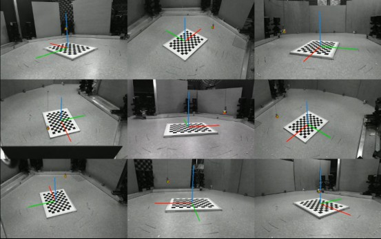
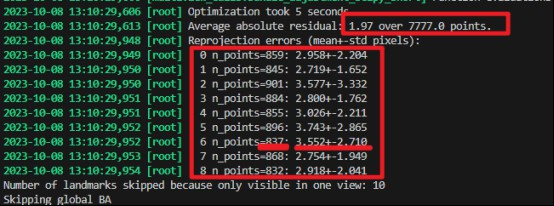

# 小球矫正的概述
使用小球开发小球标定流程，实现了快速精准的多相机标定。详细也可以参考 [multiview_ball_calib](https://github.com/chenxinfeng4/multiview_ball_calib)。这里只放大致的流程。


## 为什么需要用小球来标定
多相机外参的计算（位置和旋转角度）这对于建立准确的三维坐标模型是必须的。传统的棋盘外参标定方法要求多个相机能够同时拍摄到棋盘的正面图案，但在环绕式多相机配置中，存在视角限制。棋盘的应用效率低，而使用小球的效率高。

## 实验操作步骤
制作直径为1.5 cm的金属靶球，通过一根短杆悬吊。实验开始前，先在地面上放置一个棋盘位于记录环境的中心，用于对齐坐标系。初始时，将靶球放置原理棋盘，避免遮挡。然后，开启记录，将小球绕大鼠活动空间内遍历2分钟。使用OBS Studio软件采集多视角视频，小球运动轨迹覆盖需要矫正的空间位置。

!!! warning "重要警告"
    球的直径会影响标定精度，建议使用直径为1.5 cm的金属靶球。球的运动速度不要太快，否则产生运动模糊，影响标定精度。
    

## 用代码解析视频
```bash
#!/bin/bash
conda activate mmdet
vfile='/PATH_to_ball/BALL____2024-01-22_14-34-01.mp4'
LILAB_DIR=/home/liying_lab/chenxf/ml-project/LILAB-py/lilab

bash $LILAB_DIR/multiview_scripts_dev/p_calibration.sh $vfile carl
```

其中 `vfile` 是 OBS Studio 软件录制的视频文件路径，`carl` 是相机标定参数。脚本会自动解析视频，并生成标定结果。
常用的 相机标定参数包括：
- `ana`: 大鼠行为间1
- `bob`: 大鼠行为间2 / 小桶
- `carl`: 大鼠行为间3 / 中&大桶。

!!! warning "重要警告"
    请检查正确的相机标定参数，这些标定参数存储了预先“标定的内存”。每套多相机系统的内存有较大区别，请勿混淆，否则会导致标定结果不准确。

## 标定结果展示
在生成的 `*ball_keypoint.mp4` 中查看绿色预测点与小球的吻合程度。生成的 `*.calibpkl` 是多相机模型文件，用于后续的3D重建。



## 标定的精度评价
查看代码运行的输出。其中 `Reprojection errors` 是重投影误差，表示预测点与实际点之间的距离。误差越小，标定精度越高。通常允许在 `4.0+-2.0` 像素内。



!!! error "错误"
    运行p_calibration.sh时输出error pixel过大/keypoint视频中绿点无法正确的跟随小球，说明校正不正确。既有可能是2D识别小球有很大偏差。需要重新打标，见《ball的扩增训练》