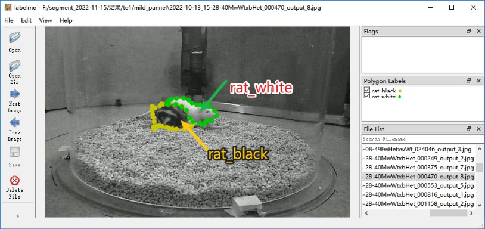
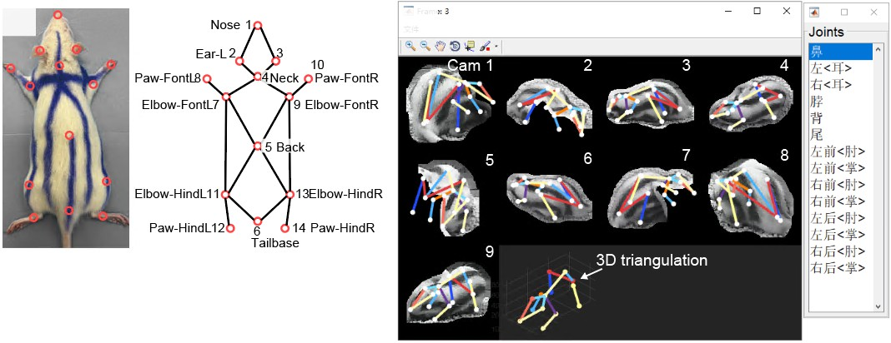

# Dataset Creation & Model Update
## Annotation: Rat Segmentation
First, use the Labelme software for data annotation. Use the `Polygon` tool to create labels for `rat_black` (black rat) and `rat_white` (white rat).



## Updating the Segmentation Model
Run the following code line by line. `mask_rcnn_r101_fpn_2x_coco_bwrat_816x512_cam9.py` is the model configuration file (default, recommended). You can switch to other model configurations if needed.

```bash
# 1. Data preparation: labelme to coco
# su chenxinfeng
conda activate DEEPLABCUT

# Rename the labelme annotation project folder.
## Note 1: The folder path must not contain Chinese characters, and the annotated images must not have Chinese filenames.
## Note 2: The number of annotated images n>20 to ensure training quality.
LABEL_ME_POJECT=/mnt/liying.cibr.ac.cn_xxx/labelimages
NEW_NAME=/mnt/liying.cibr.ac.cn_xxx/bw_rat_1280x800_20230524

mv $LABEL_ME_POJECT $NEW_NAME

# Convert the labelme annotation project folder to COCO dataset format.
# Note: Check the class names in MMDET_DATA_TARGET; do not make them up arbitrarily.
python -m lilab.cvutils.labelme_to_coco $NEW_NAME

# Split the COCO dataset into training and validation sets. The -s parameter specifies the training set ratio; 0.8 or 0.9 is commonly used.
python -m lilab.cvutils.coco_split -s 0.9 ${NEW_NAME}_trainval.json

# Copy the annotated dataset to the mmdet dataset directory.
MMDET_DATA_TARGET=/home/liying_lab/chenxinfeng/DATA/CBNetV2/data/rats
cp -r ${NEW_NAME}_trainval.json ${NEW_NAME}_train.json ${NEW_NAME}_val.json \
    ${NEW_NAME}        $MMDET_DATA_TARGET/

# 2. Model training
conda activate mmpose
cd /home/liying_lab/chenxinfeng/DATA/CBNetV2/

# Modify the configuration file; open it with VSCode.
# Update the `data` field to point to the newly copied COCO dataset directory.
CONFIG=$PWD/mask_rcnn_r101_fpn_2x_coco_bwrat_816x512_cam9.py
echo $CONFIG

# Train the model using multiple GPUs or a single GPU.
# tools/dist_train.sh $CONFIG 4
python tools/train.py $CONFIG

# 3. Model acceleration
python -m lilab.mmdet_dev.convert_mmdet2trt $CONFIG

# 4. Check whether the model has been updated successfully.
ls -lh work_dirs/mask_rcnn_r101_fpn_2x_coco_bwrat_816x512_cam9/latest.*
```

Finally, you will obtain the updated `latest.trt` model weight file.

## Annotation: Rat 3D Keypoints
First, use Label3D_Manager for data annotation. Label3D_Manager is a modified version of the official release, adapted for OBS-recorded videos and preconfigured with the 14 rat keypoints.


You should obtain an `anno.mat` file containing the annotated 3D keypoint information.

## Dataset Preparation
```
conda activate mmdet

source='/mnt/liying.cibr.ac.cn_usb3/wsy/ysj/segpkl/outframes'
datadir='/home/liying_lab/chenxinfeng/DATA/dannce/data/bw_rat_1280x800x9_2024-11-27_photometry_voxel'

cp -r $source $datadir
python -m lilab.dannce.s1_anno2dataset $datadir/anno.mat 

# Locate the generated *_voxel_anno_dannce.pkl, then correct the body center point
# (triangulate the 3D center using the 2D mask center point).
python -m lilab.dannce.p2_dataset_com3d_refine_byseg ${datadir}_anno_dannce.pkl

```

## Training the DANNCE Model
Run the following code line by line to train the model. `rat14_1280x800x9_mono_young` is a pre-created project environment (recommended). You may also choose other projects as needed.
```bash
# cd into the project directory.
cd /home/liying_lab/chenxinfeng/DATA/dannce/demo/rat14_1280x800x9_mono_young

# Modify the project configuration file and add the dataset path.
echo io_max.yaml

# Edit io_max.yaml, adding the data to exp/label3d_file.
python -m dannce.cli_train  ../../configs/dannce_rat14_1280x800x9_max_config.yaml
```

Convert the model to a TensorRT-accelerated model.
```bash
# Offline scenario.
cd /home/liying_lab/chenxinfeng/DATA/dannce/demo/rat14_1280x800x9_mono_young/DANNCE/train_results/MAX
python -m lilab.dannce.t1_keras2onnx latest.hdf5

choosecuda 3,0,1,2
polygraphy run /home/liying_lab/chenxinfeng/ml-project/LILAB-py/lilab/tensorrt/constrained_network.py \
    --precision-constraints obey \
    --trt-min-shapes input_1:[1,64,64,64,9] \
    --trt-max-shapes input_1:[4,64,64,64,9] \
    --trt-opt-shapes input_1:[2,64,64,64,9] \
    --trt --fp16 --save-engine latest_dynamic.engine &

choosecuda 0,1,2,3
polygraphy run /home/liying_lab/chenxinfeng/ml-project/LILAB-py/lilab/tensorrt/constrained_network.py \
    --precision-constraints obey \
    --input-shapes input_1:[2,64,64,64,9]\
    --trt --fp16 --save-engine latest.engine &

# Realtime scenario
python -m lilab.dannce.t1_keras2onnx_rt latest.hdf5

choosecuda 1,2,3,0
polygraphy run /home/liying_lab/chenxinfeng/ml-project/LILAB-py/lilab/tensorrt/constrained_network_rt.py \
    --precision-constraints obey \
    --trt-min-shapes input_1:[1,64,64,64,9] \
    --trt-max-shapes input_1:[2,64,64,64,9] \
    --trt-opt-shapes input_1:[1,64,64,64,9] \
    --trt --fp16 --save-engine latest.idx.engine

wait
```

Finally, you will obtain `latest_dynamic.engine` and `latest.idx.engine`.