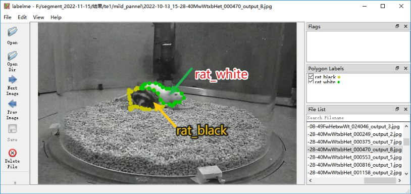

# 数据集制作&模型更新
## 标注大鼠分割
首先，使用 Labelme 软件进行数据标注。用 `Polygon` 工具，创建黑鼠 `rat_black` 和白鼠 `rat_white`的标签。


## 更新分割模型
逐行运行下面的代码，其中 `mask_rcnn_r101_fpn_2x_coco_bwrat_816x512_cam9.py` 是模型的配置文件（默认，推荐）。有需求可以改成其它的模型配置。

```bash
# 1. 数据制备： labelme to coco
# su chenxinfeng
conda activate DEEPLABCUT

# 将labelme数据标注的文件夹项目重命名。
## 注意事项1：文件夹不要有中文，打标的图片不要有中文
## 注意事项2：打标的图片数量 n>20 为了保证训练效果
LABEL_ME_POJECT=/mnt/liying.cibr.ac.cn_xxx/labelimages
NEW_NAME=/mnt/liying.cibr.ac.cn_xxx/bw_rat_1280x800_20230524

mv $LABEL_ME_POJECT $NEW_NAME

# 将labelme数据标注的文件夹项目转换为coco数据集格式。
# 注意事项：类别的名字要去 MMDET_DATA_TARGET 里面看，不要自己乱写。
python -m lilab.cvutils.labelme_to_coco $NEW_NAME

# 将coco数据集拆分训练集和验证集。 -s 参数表示训练集的比例，0.8 或 0.9为常用。
python -m lilab.cvutils.coco_split -s 0.9 ${NEW_NAME}_trainval.json

# 拷贝打标数据集到 mmdet 的数据集目录下
MMDET_DATA_TARGET=/home/liying_lab/chenxinfeng/DATA/CBNetV2/data/rats
cp -r ${NEW_NAME}_trainval.json ${NEW_NAME}_train.json ${NEW_NAME}_val.json \
    ${NEW_NAME}        $MMDET_DATA_TARGET/

# 2. 模型训练
conda activate mmpose
cd /home/liying_lab/chenxinfeng/DATA/CBNetV2/

# 修改配置文件，使用vscode打开。
# 修改其中的 `data` 字段，指向刚刚拷贝的coco数据集目录。
CONFIG=$PWD/mask_rcnn_r101_fpn_2x_coco_bwrat_816x512_cam9.py
echo $CONFIG

# 使用多 GPU 或单 GPU 训练模型
# tools/dist_train.sh $CONFIG 4
python tools/train.py $CONFIG

# 3. 模型加速
python -m lilab.mmdet_dev.convert_mmdet2trt $CONFIG

# 4. 查看模型是否更新成功
ls -lh work_dirs/mask_rcnn_r101_fpn_2x_coco_bwrat_816x512_cam9/latest.*
```
最后得到更新的 `latest.trt` 模型权重文件。


## 标注大鼠3D关键点
首先，使用 Label3D_Manager 进行数据标注。Label3D_manager 是在官方版本上做更改，以适应OBS 录制的视频，已经使用大鼠的14个关键点。


应该得到 `anno.mat` 文件，其中包含标注的3D关键点信息。

## 制备数据集
```
conda activate mmdet

source='/mnt/liying.cibr.ac.cn_usb3/wsy/ysj/segpkl/outframes'
datadir='/home/liying_lab/chenxinfeng/DATA/dannce/data/bw_rat_1280x800x9_2024-11-27_photometry_voxel'

cp -r $source $datadir
python -m lilab.dannce.s1_anno2dataset $datadir/anno.mat 

# 找到生成的*_voxel_anno_dannce.pkl，使用代码修正其身体中心点（以2D mask 中心点，三角化得到3D中心点）。
python -m lilab.dannce.p2_dataset_com3d_refine_byseg ${datadir}_anno_dannce.pkl


```


## 训练DANNCE模型
逐行运行下面的代码，用于训练模型。其中`rat14_1280x800x9_mono_young` 是一个已经被创建过的项目环境（推荐）。根据需求，也可以选择其它项目。
```bash
# cd 进入项目路径
cd /home/liying_lab/chenxinfeng/DATA/dannce/demo/rat14_1280x800x9_mono_young

# 改变项目配置文件，添加 数据集路径。
echo io_max.yaml

# 修改 io_max.yaml, 添加数据到 exp/label3d_file
python -m dannce.cli_train  ../../configs/dannce_rat14_1280x800x9_max_config.yaml
```

转化模型为 tensorrt 加速的模型。
```bash
# Offline 场景。
cd /home/liying_lab/chenxinfeng/DATA/dannce/demo/rat14_1280x800x9_mono_young/DANNCE/train_results/MAX
python -m lilab.dannce.t1_keras2onnx latest.hdf5

choosecuda 3,0,1,2
polygraphy run /home/liying_lab/chenxinfeng/ml-project/LILAB-py/lilab/tensorrt/constrained_network.py \
    --precision-constraints obey \
    --trt-min-shapes input_1:[1,64,64,64,9] \
    --trt-max-shapes input_1:[4,64,64,64,9] \
    --trt-opt-shapes input_1:[2,64,64,64,9] \
    --trt --fp16 --save-engine latest_dynamic.engine &

choosecuda 0,1,2,3
polygraphy run /home/liying_lab/chenxinfeng/ml-project/LILAB-py/lilab/tensorrt/constrained_network.py \
    --precision-constraints obey \
    --input-shapes input_1:[2,64,64,64,9]\
    --trt --fp16 --save-engine latest.engine &

# Realtime 场景
python -m lilab.dannce.t1_keras2onnx_rt latest.hdf5

choosecuda 1,2,3,0
polygraphy run /home/liying_lab/chenxinfeng/ml-project/LILAB-py/lilab/tensorrt/constrained_network_rt.py \
    --precision-constraints obey \
    --trt-min-shapes input_1:[1,64,64,64,9] \
    --trt-max-shapes input_1:[2,64,64,64,9] \
    --trt-opt-shapes input_1:[1,64,64,64,9] \
    --trt --fp16 --save-engine latest.idx.engine

wait
```

最后得到 `latest_dynamic.engine` 和 `latest.idx.engine`。