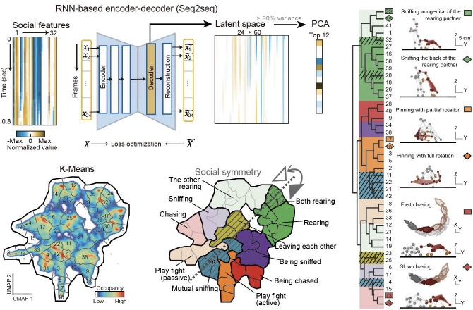

# 社交标签序列化
*参考 “[安装示例代码 > 游乐场](../../安装示例流程代码/pipeline_playground_installation/)”，运行完整代码。*

    
视频: 社交聚类的可视化与对称性

    <video controls muted playsinline style="width: 480px;" data-src="../../../assets/hls_videos/VideoS5_social_modules_24090117/playlist.m3u8"></video>

 

## 社交特征设计
获取两只动物长时间身体坐标点，它们的轨迹变化信息为我们探索动物社交类型提供了基础。基于这些坐标点，我们设计
了一系列特征（共32个），更好的展示社交的特点。

包括10个动物自身运动的特征。考虑到社交行为具有独特的互动模式，
我们还设计了两者交互的10个特征。大鼠在社交探索过程中，伴随许多头部和生殖腺嗅闻行
为以熟悉彼此，因此我们划定了头部和生殖腺的圆形嗅闻区域，并构造了 3 个区分嗅
闻位点的特征。在玩耍打斗和交配爬跨时，大鼠伴随着身体躯干间的上下重叠，因此我
们设计了 9 个身体重叠特征。

## 社交特征聚类
我们将社交视频以0.8秒时间窗切割，得到（32特征x24帧）的高维特征。再采用了一个基于 RNN 的自编码器模型Seq2Seq，提取行为的空间和时间特征，可以区分外观和运动有差异的行为类型。再将Decoder编码的潜特征用PCA降维到90%的方差可解释性（前12维PC）。使用 K-means 无监督聚类，得到约40-50个行为类别。

对于每个行为类别，我们观察了典型的视频片段并进行了人工注解。通过这一过程，许多熟悉的社交行为类型被成功聚类，如嗅探、追逐、接近、离开和玩耍，较为全面地覆盖了大鼠的社交模式。通过将行为类别投影在二维 UMAP 空间中，构成了更便于可视化的社交行为图谱。在 UMAP 社交图谱
中，不同大类的行为被分隔在各自的区域，相邻区域的行为比较相似。及时相似的行为，在细微的特征上有所区别，比认为设定更为细致。因此，自动化聚类的方法，无需人工标注，可以部分替代人工对行为的观察。

## 社交一致性的聚类优化
在对行为分类结果的视频片段进行详尽审查的过程中，本研究识别出部分类别中存在与人工标注预期行为不一致的非典型片段。社交行为的固有特性为优化算法提供了独特条件，它允许从不同个体的视角审视同一社交互动。同一社交互动片段在两个不同角色视角下分别计算标签（2份标签），标签一致时该片段的分类更可靠。本研究从白鼠和黑鼠的视角分别对社交行为进行归类，得到双重标签，并识别这些标签的一致性匹配关系。在 42 个行为类别中自动筛选出 36 种具有互补性的行为。这 36 类行为被称为可靠的聚类类别。再训练神经网络，重新将所有视频片段划分到 36 类可靠聚类中。

