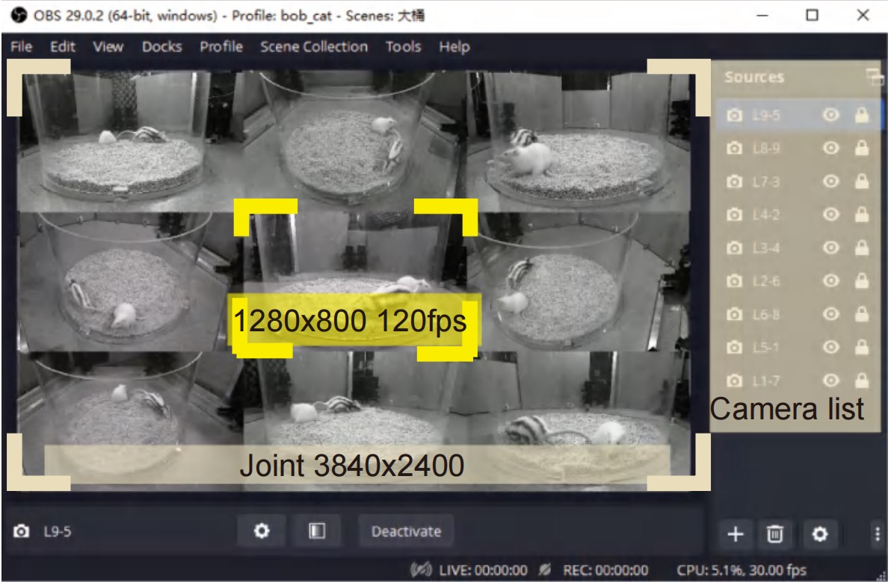

OBS 软件安装
---

视频教程：xxx

系统采用 OBS Studio（版本 **29.0**）进行视频录制。OBS 以其优秀的可配置性、稳定性和开源特性在视频直播和录制领域广泛应用。该软件支持多种来源输入，包括图像、文本、浏览器窗口、摄像头和麦克风等，**有效简化了多相机同步录制的复杂性**。其多线程负载优化和 GPU 视频编解码具有**出色的性能表现**。在本平台中，OBS 提供了实时预览、多相机布局、分辨率调整和编程接口等全面而灵活的视频录制解决方案。OBS 的具体配置详见下表。

> OBS 版本29.0, 下载地址： https://obsproject.com/download

| 对象       | 主要功能                                           | 参数                                                                                     |
|------------|----------------------------------------------------|------------------------------------------------------------------------------------------|
| 来源 > 添加 > 视频采集设备 | 添加 9 个K1S293相机                                      | 单个相机分辨率下拉列表中，选择 1280×800，帧率为最高 (即120fps)，帧编码为MJPEG |                                  |
| 设置> 输出> 录像| 录像文件格式 | 类型为标准； 文件名为无空格； 输出容器为 MP4； 编码器为 NVIDIA NVENC HEVC; 码率为30 Mbps；预设为高质量。|
| 设置> 视频| 画布分辨率和帧率 | 画布分辨率 3840×2400，为 9 个相机拼接后的像素和；不缩放；帧率 30 fps。|
| 菜单 > 工具 > WebSocket 服务器 | 外部代码控制 OBS 录制开关 | 端口号 4455; 不使用密码（取消权鉴框）；推荐配合F2 同步助手使用|

在 OBS 软件的具体配置过程中，需重点关注以下技术细节：

1. 在将多相机视频流添加至 OBS 画布时，应避免对相机视角进行拉伸或裁剪，以防止图像数据丢失并确保后续多相机图像读取的准确定位。
2. 多相机图像在 OBS 画布中应紧密排列，相机编号需遵循从左到右、从上到下的顺序。
3. 有些相机拍摄的图像上下颠倒，需在 OBS 软件上进行 180°旋转修正，但不要使用镜像。

完成上述配置后，即可通过 OBS 界面启动录制，同步记录 9 个相机的行为实验视频。通常，15分钟的实验视频约为3.4GB。使用 Potplayer 或者 VLC 等播放器，可以方便地查看视频。