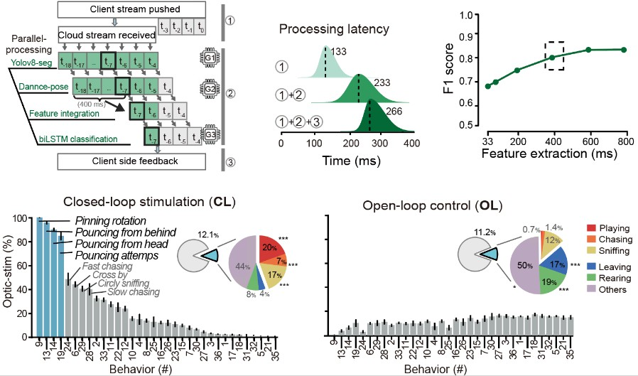

# 闭环行为控制 ⚡️

    
视频: 实时 "玩耍行为识别" 驱动光遗传刺激

    <video controls muted playsinline style="width: 480px;" data-src="../../assets/hls_videos/VideoS6_closed-loop_250430/playlist.m3u8"></video>

 

利用光遗传技术实现精准行为控制，通过实时行为分析形成闭环反馈系统。

- ❓ **挑战**：实时行为识别计算量大，完整模型难以在实验环境部署；边缘设备小模型精度不足；非特异性多巴胺刺激对孤独症行为改善效果有限。
- 💡 **解决方案**：采用云计算进行行为识别，实验视频上传至云平台处理并返回结果。通过模型轻量化和GPU流水线并行优化降低延迟，并建立孤独症行为-光遗传强化学习范式，在识别到玩耍行为时给予特异性多巴胺光刺激。
- 🎉 **效果**：行为识别延迟仅266ms，准确率达80%。特异性光遗传强化学习显著改善孤独症大鼠（*Shank3* +/-）的玩耍行为，增强社交能力并减少非社交行为。

  

## 设计原理和精度测量

将行为识别模型部署在云端，通过实时视频流上传实现闭环行为控制。模型经过轻量化改造和GPU流水线并行优化以降低计算延迟。光遗传激光器通过 **Arduino** 板控制，以发放 *40 Hz* 的脉冲光刺激。

实验设计中，实验组在 *Shank3* +/- 大鼠主动玩耍时给予多巴胺释放光刺激；对照组在非玩耍行为条件下随机光刺激，保持光刺激总量一致。

测试结果（n=32视频）显示，实验组在玩耍时给光超过90%，而对照组不足10%。实验组的光刺激更多分配到玩耍相关的社交行为，对照组则更多分配到非社交行为。显示出闭环行为控制的精准性。最终观察到 *Shank3* +/- 大鼠的玩耍行为和社交能力改善。

  

