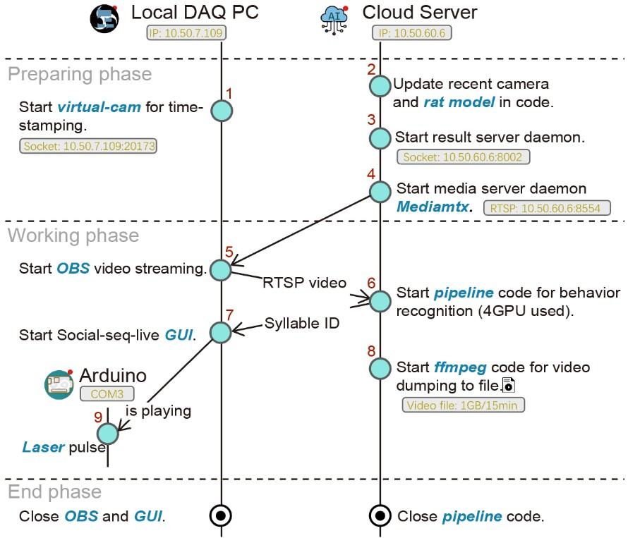
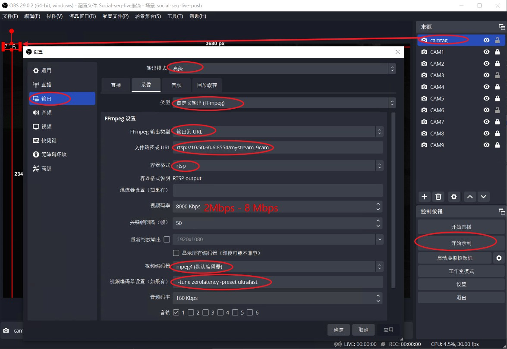

# 代码流程
> 开发者: Chenxinfeng, update 2025-08-16

闭环行为控制的代码流程梗概如下:



一下是对应的代码操作：
## 1. Start **Virtual-Cam** for time stamping.
在DAQ的PC上进行操作，DAQ安装的是Windows系统。OBS Studio 29.1 版本。OBS 需要添加一个虚拟摄像头("OBS Virtual Camera")，python代码会往这个摄像头帧输出时间码（例如，163）。时间码的数值由PC的时钟决定，每33ms更新一次（30fps 匹配视频帧率），当前时钟的数值也会存储到 `10.50.7.109:20173` 的服务器上，供其他设备访问，以获取当前时间码。

```python
# virtualcam.py
import numpy as np
import pyvirtualcam
import tqdm
import cv2
import socketserver
import threading

HOST, PORT = "0.0.0.0",20173


downratio = 2
width, height = 240//downratio, 120//downratio
vout = pyvirtualcam.Camera(width=width+40, height=height, fps=30, device='OBS Virtual Camera') # device='OBS Virtual Camera'
isactivate = False
strn = '000'


def thread_cam():
    global strn
    tbar = tqdm.tqdm()
    n=0
    global isactivate
    countdown = 15
    while True:
        tbar.update()
        frame = np.zeros((height, width+40, 3), np.uint8)
        if isactivate:
            frame[:,width+4:,1] = 255
            countdown -= 1
            if countdown <=0:
                isactivate = False
                countdown = 15
        
        strn = str(n%1000).zfill(3)
        cv2.putText(frame, strn, (5//downratio, 105//downratio), 
                    cv2.FONT_HERSHEY_SIMPLEX, 4//downratio, (255,255,255), 2)
        n+=1
        vout.send(frame)
        vout.sleep_until_next_frame()
    

class ThreadedTCPServer(socketserver.ThreadingMixIn, socketserver.TCPServer):
    pass

class MyTCPHandler(socketserver.BaseRequestHandler):
    """
    The request handler class for our server.

    It is instantiated once per connection to the server, and must
    override the handle() method to implement communication to the
    client.
    """

    def handle(self):
        # self.request is the TCP socket connected to the client

        print("conn is :",self.request) # conn
        print("addr is :",self.client_address) # addr

        try:
            while True:
                data = self.request.recv(1024)
                msg = data.decode("utf-8").strip()
                self.msgfilter(msg)
                if not data:break
        except Exception as e:
            print(e)

        print('Closed a request')

    def msgfilter(self, msg):
        global isactivate
        if msg=='start_record':
            isactivate = True
            self.request.sendall('starting'.encode("utf-8"))
        elif msg=='stop_record':
            isactivate = False
            self.request.sendall('stopping'.encode("utf-8"))
        elif msg=='get_status':
            self.request.sendall(strn.encode("utf-8"))
        else:
            self.request.sendall(msg.upper())


if __name__ == "__main__":
    threading.Thread(target=thread_cam, name='thread_cam').start()

    print('start socket server')
    with ThreadedTCPServer((HOST, PORT), MyTCPHandler) as server:
        # Activate the server; this will keep running until you
        # interrupt the program with Ctrl-C
        server.serve_forever()
```

在终端执行该脚本，启动虚拟摄像头，并开启socket服务。
在github上下载，[`virtual_LED.py`🔗](https://github.com/chenxinfeng4/social-seq-live-client-GUI/blob/main/pyvirtualcam_LED/virtual_LED.py)
```bash
python3 virtual_LED.py
```

!!! note "提示"
    建议将其存为windows 的 bat 文件，双击直接运行。该脚本还兼具虚拟LED颜色点亮的功能，可用于视频事件打标，例如用于光遗传Laser的触发事件打标。详细可参考 【#7】 GUI 的代码。

!!! warning "注意"
    需要自行安装依赖库。让DAQ PC的防火墙开放 20173。


## 2. Update recent camera and **rat model** in code.
需要用户提供最新的多相机模型文件和大鼠社交关键点模型文件，并更新到代码中。前者用于3D重构；后者用于计算相同年龄大鼠的体长，便于行为特征归一化。通常，`大鼠社交关键点模型`文件包含了`多相机模型`，所以让多相机模型等于`大鼠社交关键点模型`即可。

修改下面文件的`lilab/label_live/usv_yolo_seg_dannce_unit_test.py`中的 `CALIBPKL` 未多相机模型路径， `model_smooth_matcalibpkl` 为大鼠社交关键点模型路径。
```python
# PATH_TO_LILAB/lilab/label_live/usv_yolo_seg_dannce_unit_test.py
CALIBPKL = '/mnt/liying.cibr.ac.cn_Data_Temp_ZZC2/2506batch-chr2/test/ball/2025-06-13_10-16-58_ball.calibpkl'
model_smooth_matcalibpkl = '/DATA/zhongzhenchao/2501chr2-shank3/all400p/2025-01-05_15-04-37_l7_sm1_pm6.smoothed_foot.matcalibpkl'

model_smooth_matcalibpkl = CALIBPKL = '/a/b/c.matcalibpkl'
```

## 3. Start **result server** daemon.
```bash
source activate mmdet # activate the conda environment
python -m lilab.label_live.socketServer
```

!!! warning "注意"
    注意Cloud Server防火墙，开放8002端口。如果出现端口被占用的情况，往往是因为上一个Python程序未正常关闭。请先关闭占用该端口的程序，或执行 `lsof -i:8002` 查看占用该端口的进程，然后kill掉该进程（`kill -9 进程号`）。稍等10秒，重启该程序。多次尝试。


## 4. Start media server daemon **Mediamtx**.
在Cloud Server上启动Mediamtx，用于接收OBS的推流，并转发给客户端。
```bash
docker run --rm -it -p 8554:8554 bluenviron/mediamtx
```

!!! warning "注意"
    注意Cloud Server防火墙，开放8554端口。

## 5. Start **OBS** video streamming.
在DAQ PC上启动OBS，并推流到Cloud Server的Mediamtx。

我已经配置好OBS，可以通过下面的简便操作启动推流配置：

- 选择，菜单>配置文件> Social-seq-live推流 
- 选择，菜单>场景集合> Social-seq-live-push

然后，点击 "开始录制"按钮（注意不是“开始直播”），进行推流。20秒内不弹出错误提示，表示推流成功。

对于新的DAQ PC，需要重新配置OBS，具体步骤如下：



!!! info "提示"
    分辨率和编码方式是影响推流延迟的重要参数，尤其是项目的3840x2400是高分辨率。这套RTSP参数设置，是经过多种测试，延迟低，画质好的参数。其它视频推流的项目，可以参考这个参数设置。

!!! warning "注意"
    注意OBS的推流地址，需要填写Cloud Server的IP地址，应该是 `rtsp://10.50.60.6:8554/mystream_9cam`。可以通过 VLC 或 ffplay 等工具，测试是否能够正常播放该流。电脑的性能决定了推流的流畅度，如果电脑性能较差，可能推流不流畅，或者出现卡顿现象。另外，码率（bitrate）需要设低 8Mbps，否则推流延迟高。


## 6. Start **pipeline** code for behavior recognition.
在Cloud Server上启动行为识别程序，用于接收OBS的推流，并识别行为，将识别结果标签（Syllable ID）存放到 Result server daemon 中。

```bash
source activate mmdet  # activate the conda environment
PATH=/usr/bin:$PATH python -m lilab.label_live.usv_yolo_seg_dannce_unit_test
```

!!! warning "注意"
    注意查看是否有报错信息。确保OBS已经正常推流，并且推流地址正确。

!!! warning "注意"
    检查终端输运行帧率（30fps）和延迟(<10帧)。显示iteration 应该约为 30its/s，并且延迟帧数应该在6-10以内。太高的延迟帧（>30帧），导致闭环刺激精度的严重下降。经验原因是 1.DAQ PC性能太差，需要重启OBS软件（通常）；或者2 是有人在使用Cloud Server，抢占了CPU和GPU资源，则清空这些用户的资源（提前组内沟通）。

## 7. Start Social-seq-live **GUI**.
去github 上下载 [Social-seq-live](https://github.com/chenxinfeng4/social-seq-live-client-GUI) 的代码，并安装依赖包。

```cmd
python main.py   # GUI程序，“闭环控制”实验组
python main_exclude.py   # GUI程序，“开环控制”对照组
```

!!! warning "注意"
    注意“闭环控制”实验组和“开环控制”对照组的GUI程序不同。操作步骤相同。闭环控制，在识别到行为后，自动启动刺激。开环控制，需要排除目标行为，随机给刺激。


接着选择对应的GUI程序，并启动。连接 **Cloud Server** 和 **Arduino**后，即自动开始行为识别并光遗传控制。

- 在GUI中，勾选合适的目标行为，例如 "pouncing", "pinning", "chasing" 等。
- 填入**Cloud Server** 的IP地址，点击“Connect”按钮，连接到Result server daemon。
- 选择 **Arduino** 串口，并点击“Connect”按钮，连接到Arduino。（*Arduino 需要初始化烧录代码，参考【#9】*）

## 8. Start ffmpeg code for video dumping to file.
在动物实验开始后，需要记录视频。由于原先的OBS 录像功能已经被占用，因此只能在Cloud Server 上记录视频。

将下面的代码保存为**Cloud Server** 的 RT_record.sh 文件。每次动物实验开始后，并运行它。它会在 /DATA/chenxinfeng 目录下，保存一个视频文件。文件名是当前时间，例如 2025-01-01_12-00-00.mp4。

```bash
#!/bin/bash
# 保存为 RT_record 文件
filename=`date --date='2.2 seconds' +"%Y-%m-%d_%H-%M-%S"`
/home/liying_lab/chenxinfeng/.conda/envs/mmdet/bin/ffmpeg.bak -rtsp_transport tcp -t 00:15:06 -i rtsp://10.50.60.6:8554/mystream_9cam  -ss 00:00:02.2 -c:v hevc_nvenc  -b:v 10M -maxrate:v 20M  -preset:v p4 /DATA/chenxinfeng/${filename}.mp4
```

## 9. Arduino Laser pulse
去github 上下载 [Arduino Laser pulse](https://github.com/chenxinfeng4/social-seq-live-client-GUI/blob/main/seqlive_board/seqlive_board.ino) 的代码，并进行烧录。

```bash
const int PinNum = 6;             // the number of the LED pin
const float duration = 0.5;         // time for running, unit = sec.
const float Hz = 40;              // frequency, unit = Hz.
const float Duty = 0.2;           // duty, unit = 0~1.
```
该代码表示Arduino 的 D6 引脚，连接到激光器的触发引脚。单词刺激时间为 0.5 秒，激光频率为 40Hz，占空比为 0.2 （5ms）。

## Close OBS and GUI
在实验结束后，复原 OBS 的配置，关闭OBS软件；关闭Social seq live GUI。在Cloude Server上，关闭 **pipeline**。