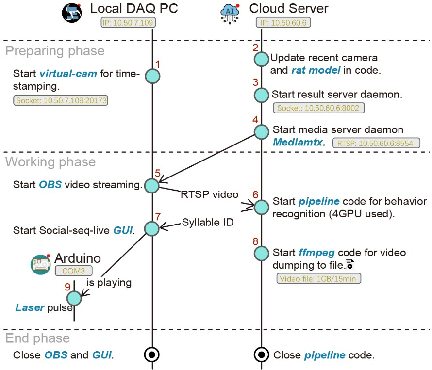
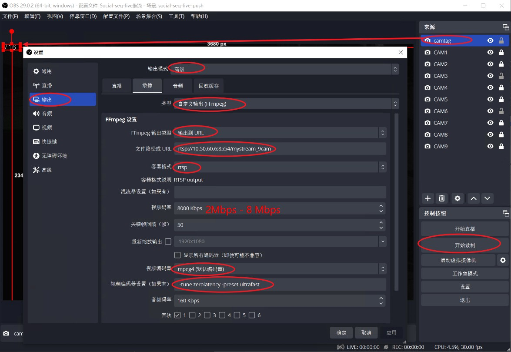

# 代码流程
> 开发者: Chenxinfeng, update 2025-08-16

闭环行为控制的代码流程梗概如下:



以下是对应的代码操作：

## 1. 启动虚拟摄像头进行时间戳标记

在DAQ的PC上进行操作，DAQ安装的是Windows系统。OBS Studio 29.1 版本。OBS 需要添加一个虚拟摄像头("OBS Virtual Camera")，python代码会往这个摄像头帧输出时间码（例如，163）。时间码的数值由PC的时钟决定，每33ms更新一次（30fps 匹配视频帧率），当前时钟的数值也会存储到 `10.50.7.109:20173` 的服务器上，供其他设备访问，以获取当前时间码。

在github上下载，[`virtual_LED.py`🔗](https://github.com/chenxinfeng4/social-seq-live-client-GUI/blob/main/pyvirtualcam_LED/virtual_LED.py).

在终端执行该脚本，启动虚拟摄像头，并开启socket服务。

```bash
python3 virtual_LED.py
```

!!! note "提示"
    建议将其存为windows 的 bat 文件，双击直接运行。该脚本还兼具虚拟LED颜色点亮的功能，可用于视频事件打标，例如用于光遗传Laser的触发事件打标。详细可参考 【#7】 GUI 的代码。

!!! warning "注意"
    需要自行安装依赖库。让DAQ PC的防火墙开放 20173。


## 2. 更新代码中的相机和大鼠模型

需要用户提供最新的多相机模型文件和大鼠社交关键点模型文件，并更新到代码中。前者用于3D重构；后者用于计算相同年龄大鼠的体长，便于行为特征归一化。通常，`大鼠社交关键点模型`文件包含了`多相机模型`，所以让多相机模型等于`大鼠社交关键点模型`即可。

修改下面文件的`lilab/label_live/usv_yolo_seg_dannce_unit_test.py`中的 `CALIBPKL` 为多相机模型路径， `model_smooth_matcalibpkl` 为大鼠社交关键点模型路径。

```python
# PATH_TO_LILAB/lilab/label_live/usv_yolo_seg_dannce_unit_test.py
CALIBPKL = '/mnt/liying.cibr.ac.cn_Data_Temp_ZZC2/2506batch-chr2/test/ball/2025-06-13_10-16-58_ball.calibpkl'
model_smooth_matcalibpkl = '/DATA/zhongzhenchao/2501chr2-shank3/all400p/2025-01-05_15-04-37_l7_sm1_pm6.smoothed_foot.matcalibpkl'

model_smooth_matcalibpkl = CALIBPKL = '/a/b/c.matcalibpkl'
```

## 3. 启动结果服务器守护进程

```bash
source activate mmdet # activate the conda environment
python -m lilab.label_live.socketServer
```

!!! warning "注意"
    注意Cloud Server防火墙，开放8002端口。如果出现端口被占用的情况，往往是因为上一个Python程序未正常关闭。请先关闭占用该端口的程序，或执行 `lsof -i:8002` 查看占用该端口的进程，然后kill掉该进程（`kill -9 进程号`）。稍等10秒，重启该程序。多次尝试。


## 4. 启动媒体服务器守护进程 Mediamtx

在Cloud Server上启动Mediamtx，用于接收OBS的推流，并转发给客户端。

```bash
docker run --rm -it -p 8554:8554 bluenviron/mediamtx
```

!!! warning "注意"
    注意Cloud Server防火墙，开放8554端口。

## 5. 启动 OBS 视频流

在DAQ PC上启动OBS，并推流到Cloud Server的Mediamtx。

我已经配置好OBS，可以通过下面的简便操作启动推流配置：

- 选择，菜单>配置文件> Social-seq-live推流 
- 选择，菜单>场景集合> Social-seq-live-push

然后，点击 "开始录制"按钮（注意不是“开始直播”），进行推流。20秒内不弹出错误提示，表示推流成功。

对于新的DAQ PC，需要重新配置OBS，具体步骤如下：



!!! info "提示"
    分辨率和编码方式是影响推流延迟的重要参数，尤其是项目的3840x2400是高分辨率。这套RTSP参数设置，是经过多种测试，延迟低，画质好的参数。其它视频推流的项目，可以参考这个参数设置。

!!! warning "注意"
    注意OBS的推流地址，需要填写Cloud Server的IP地址，应该是 `rtsp://10.50.60.6:8554/mystream_9cam`。可以通过 VLC 或 ffplay 等工具，测试是否能够正常播放该流。电脑的性能决定了推流的流畅度，如果电脑性能较差，可能推流不流畅，或者出现卡顿现象。另外，码率（bitrate）需要设低 8Mbps，否则推流延迟高。


## 6. 启动行为识别流水线代码

在Cloud Server上启动行为识别程序，用于接收OBS的推流，并识别行为，将识别结果标签（Syllable ID）存放到 Result server daemon 中。

```bash
source activate mmdet  # activate the conda environment
PATH=/usr/bin:$PATH python -m lilab.label_live.usv_yolo_seg_dannce_unit_test
```

!!! warning "注意"
    注意查看是否有报错信息。确保OBS已经正常推流，并且推流地址正确。

!!! warning "注意"
    检查终端输运行帧率（30fps）和延迟(<10帧)。显示iteration 应该约为 30its/s，并且延迟帧数应该在6-10以内。太高的延迟帧（>30帧），导致闭环刺激精度的严重下降。经验原因是 1.DAQ PC性能太差，需要重启OBS软件（通常）；或者2 是有人在使用Cloud Server，抢占了CPU和GPU资源，则清空这些用户的资源（提前组内沟通）。

## 7. 启动 Social-seq-live GUI

去github 上下载 [Social-seq-live](https://github.com/chenxinfeng4/social-seq-live-client-GUI) 的代码，并安装依赖包。

```cmd
python main.py   # GUI程序，“闭环控制”实验组
python main_exclude.py   # GUI程序，“开环控制”对照组
```

!!! warning "注意"
    注意“闭环控制”实验组和“开环控制”对照组的GUI程序不同。操作步骤相同。闭环控制，在识别到行为后，自动启动刺激。开环控制，需要排除目标行为，随机给刺激。


接着选择对应的GUI程序，并启动。连接 **Cloud Server** 和 **Arduino**后，即自动开始行为识别并光遗传控制。

- 在GUI中，勾选合适的目标行为，例如 "pouncing", "pinning", "chasing" 等。
- 填入**Cloud Server** 的IP地址，点击“Connect”按钮，连接到Result server daemon。
- 选择 **Arduino** 串口，并点击“Connect”按钮，连接到Arduino。（*Arduino 需要初始化烧录代码，参考【#9】*）

## 8. 启动 ffmpeg 代码以将视频转储到文件

在动物实验开始后，需要记录视频。由于原先的OBS 录像功能已经被占用，因此只能在Cloud Server 上记录视频。

将下面的代码保存为**Cloud Server** 的 RT_record.sh 文件。每次动物实验开始后，并运行它。它会在 /DATA/chenxinfeng 目录下，保存一个视频文件。文件名是当前时间，例如 2025-01-01_12-00-00.mp4。

```bash
#!/bin/bash
# 保存为 RT_record 文件
filename=`date --date='2.2 seconds' +"%Y-%m-%d_%H-%M-%S"`
/home/liying_lab/chenxinfeng/.conda/envs/mmdet/bin/ffmpeg.bak -rtsp_transport tcp -t 00:15:06 -i rtsp://10.50.60.6:8554/mystream_9cam  -ss 00:00:02.2 -c:v hevc_nvenc  -b:v 10M -maxrate:v 20M  -preset:v p4 /DATA/chenxinfeng/${filename}.mp4
```

## 9. Arduino 激光脉冲

去github 上下载 [Arduino Laser pulse](https://github.com/chenxinfeng4/social-seq-live-client-GUI/blob/main/seqlive_board/seqlive_board.ino) 的代码，并进行烧录。

```bash
const int PinNum = 6;             // the number of the LED pin
const float duration = 0.5;         // time for running, unit = sec.
const float Hz = 40;              // frequency, unit = Hz.
const float Duty = 0.2;           // duty, unit = 0~1.
```
该代码表示Arduino 的 D6 引脚，连接到激光器的触发引脚。单次刺激时间为 0.5 秒，激光频率为 40Hz，占空比为 0.2 （5ms）。

## 关闭 OBS 和 GUI

在实验结束后，复原 OBS 的配置，关闭OBS软件；关闭Social seq live GUI。在Cloude Server上，关闭 **pipeline**。